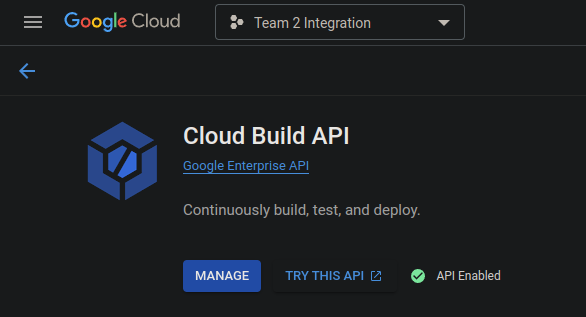

# Deployment Documentation

Default service (frontend) url:  
https://kdg-acs3-integration-5-team-2.ew.r.appspot.com/  
Expressjs backend service (backend) url:  
https://backend-dot-kdg-acs3-integration-5-team-2.ew.r.appspot.com/api  
Spring backend service (spring-backend) url:  
https://spring-backend-dot-kdg-acs3-integration-5-team-2.ew.r.appspot.com/api

### This file displays how the deployment was set up line by line
```
# Check if you have the gcloud SDK installed locally
man gcloud

# Create the project
gcloud projects create kdg-acs3-integration-5-team-2 --name='Team 2 Integration'

# Check if the project was created
gcloud projects list

PROJECT_ID                     NAME                PROJECT_NUMBER
kdg-acs3-integration-5-team-2  Team 2 Integration  864074054270

# Switch to said project
gloud config set project kdg-acs3-integration-5-team-2

# Create an App Engine project in the Belgium region (europe-west)
gcloud app create --region=europe-west

# Remember to activate the Cloud Build API
```


```
# Deploy the services
gcloud app deploy frontend/app.yaml
gcloud app deploy backend/app.yaml
```

